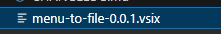

# 方便的从路由菜单和配置快速定位到源文件。

- 有时候系统菜单很多，而且路由的名称有些和文件对不上，vscode 自带的 ctrl+p 无法定位到文件。

1. 安装工具

   ```bash
       npm install --global yo generator-code
   ```

2. 生成一个模板
   ```bash
       yo code
   ```

- 选择需要开发的模式，等待一波。然后开始开发。

1. 在 package.json 中注册指令，并且增加说明和快捷键。
   ```json
   {
     "configuration": {
       "properties": {
         "menu-to-file.menus": {
           "type": "array",
           "default": [],
           "description": "菜单列表"
         }
       }
     },
     "commands": [
       {
         "command": "menu-to-file.openFile",
         "title": "打开文件"
       }
     ],
     "keybindings": {
       "command": "menu-to-file.openFile",
       "key": "ctrl+m",
       "when": "editorTextFocus"
     },
     "contributes": {
       "commands": [
         {
           "command": "menu-to-file.openFile",
           "title": "打开文件"
         }
       ]
     }
   }
   ```
2. 在入口文件里面生命指令

   ```ts
   let disposable = vscode.commands.registerCommand(
     "menu-to-file.openFile",
     () => {
       // 创建一个输入框
       const inputBox = vscode.window.createInputBox();
       inputBox.title = "请输入路由名称";
       let value = "";
       // 监听输入事件
       inputBox.onDidChangeValue((val) => {
         value = val;
       });
       // 回车
       inputBox.onDidAccept((val) => {
         inputBox.hide();
         // 匹配真实地址
         const realPath = searchFromMenus(value);
         if (realPath) {
           // 拼接地址
           const folderPath = path.resolve(
             vscode.workspace.workspaceFolders![0]!.uri.fsPath,
             realPath
           );
           // 打开文件
           vscode.workspace.openTextDocument(folderPath).then((res) => {
             vscode.window.showTextDocument(res);
           });
         } else {
           vscode.window.showInformationMessage(`未查到${value}相关信息`);
         }
       });
       inputBox.show();
     }
   );
   context.subscriptions.push(disposable);
   ```

3. ok！开始调试！

   - 点击 运行->启动调试 将会打开一个调试窗口。
   - 按下上面设置的快捷键 ctrl+m 将会出现一个输入框。
     
   - 输入要搜索的路由名称，然后点击回车。
     
     
   - 顺利打开源文件  
     

### 打包

- 这里就本地打包了不发布到线上了(线上需要创建一个开发账户生成一个 token 和 npm 包发布差不多)

1. 安装 vsce (node >= 18)

   ```bash
   npm install -g @vscode/vsce

   ```

2. 修改一下 README.md
3. 开始打包
   ```bash
     vsce package
   ```

- 打包完成  
  

### 本地安装

- 打开扩展，选择从 vsix 安装
  
- 选择刚打包的文件
- ok 安装完成
- 
