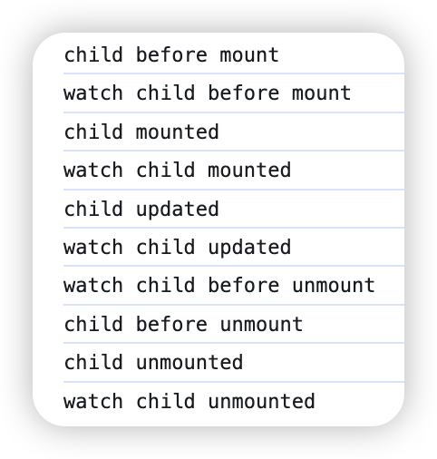

# 通过内置 emit 监听子组件的生命周期

## 在线案例

<script setup>
import ParentDemo from './components/parent.vue'
</script>

<ParentDemo/>

## 执行顺序



## 源码

### Parent.vue

```vue
<template>
  <div>
    <button @click="showChild = !showChild">toggle</button>
    <ChildCom
      v-if="showChild"
      @vue:beforeMount="onChildBeforeMount"
      @vue:mounted="onChildMounted"
      @vue:updated="onChildUpdated"
      @vue:beforeUnmount="onChildBeforeUnmount"
      @vue:unmounted="onChildUnMounted"
    />
  </div>
</template>

<script setup>
import { ref } from "vue";
import ChildCom from "./child.vue";

const showChild = ref(false);

const onChildBeforeMount = () => {
  console.log("watch child before mount");
};
const onChildMounted = () => {
  console.log("watch child mounted");
};
const onChildUpdated = () => {
  console.log("watch child updated");
};
const onChildBeforeUnmount = () => {
  console.log("watch child before unmount");
};
const onChildUnMounted = () => {
  console.log("watch child unmounted");
};
</script>

<style scoped></style>
```

### Child.vue

```vue
<template>
  <div class="mt-15">
    <div class="mt-15">子组件</div>
    <input
      class="mt-15"
      type="text"
      v-model="currentVal"
      placeholder="请输入内容"
    />
  </div>
</template>

<script setup>
import {
  onBeforeMount,
  onBeforeUnmount,
  onMounted,
  onUnmounted,
  onUpdated,
  ref,
} from "vue";

const currentVal = ref("");

onBeforeMount(() => {
  console.log("child before mount");
});
onMounted(() => {
  console.log("child mounted");
});
onUpdated(() => {
  console.log("child updated");
});
onBeforeUnmount(() => {
  console.log("child before unmount");
});
onUnmounted(() => {
  console.log("child unmounted");
});
</script>

<style scoped>
.mt-15 {
  margin-top: 15px;
}
</style>
```
